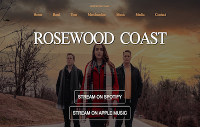
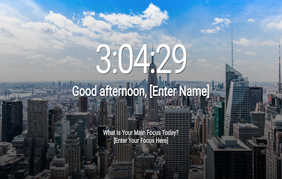

## Portfolio

---

<!--### Category Name 1 -->

[Rosewood Coast Website Build](/Projects/Rosewood_Coast)
 

[Kali Marsh Theatre Website](/Website/Projects/Kali_Website/index.html)

[Landing Page](https://zss3.github.io/landing_page/landing.html)

<!--### Category Name 2 empty commit

<!--- [Project 1 Title](http://example.com/)
- [Project 2 Title](http://example.com/)
- [Project 3 Title](http://example.com/)
- [Project 4 Title](http://example.com/)
- [Project 5 Title](http://example.com/) -->

---
<!-- 
Page template forked from <a href="https://github.com/evanca/quick-portfolio">evanca</a>
 -->
<!-- Remove above link if you don't want to attibute -->
